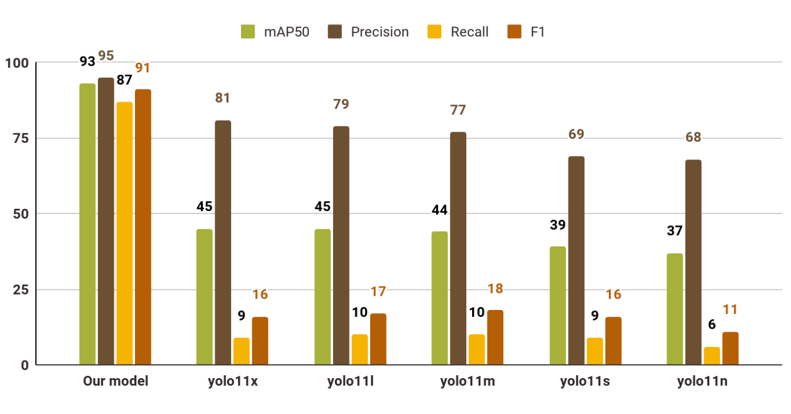

# SkyRescueAI
> Real-time Human Detection in wild nature during rescue operations

## Overview
The most current implementations rely on human pilots to control the drones, limiting the effectiveness of these operations due to human constraints. This project proposes the development of an autonomous model capable of detecting people from drone-captured images in forested environments at altitudes up to 100 meters. The model aims to enhance the efficiency of rescue missions by automating the detection process, reducing reliance on manual intervention, and improving response times in critical situations

## Folder structure
```
.
├── assets -- file assets for readme
├── data_preparation
│   └── clear_data.py -- data preparation script
├── demo
│   └── script.py -- demo script
├── metrics.ipynb -- script to calculate metrics along different models
└── training.ipynb -- main trainining script executed on GPU server
```

## Usage
Prerequirements:
- python 3.11 or greater
- uv installed on the system
- dataset prepared locally

Execute the following script to run the demo:
```bash
git clone https://github.com/Amine-Trabelsi/SkyRescueAI.git
cd SkyRescueAI/demo

uv run script.py \
    --model-name <path to weights or YOLO model name> \
    --device <cpu/gpu/mps> \
    --images <dataset path/images> \
    --window-size <width> <height> \
    --conf <confidence threshold>
```

Run `help` for additional information
```
uv run script.py --help
```

## Metrics


## Dataset
Dataset is avaiable at: https://storage.yandexcloud.net/computer-vision-rescui-lite/lite-train.zip

## Model weights
Model weight is avaible at: https://storage.yandexcloud.net/computer-vision-rescui-lite/our-model.pt
